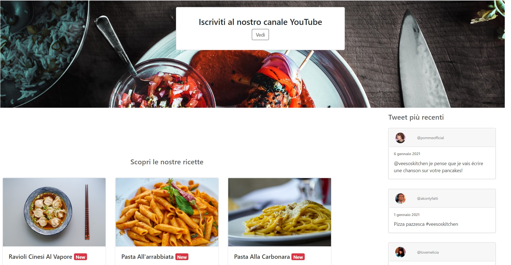
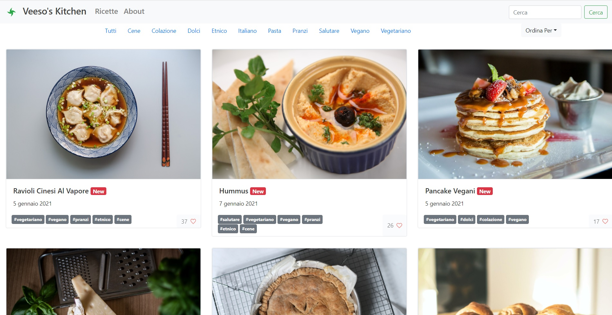
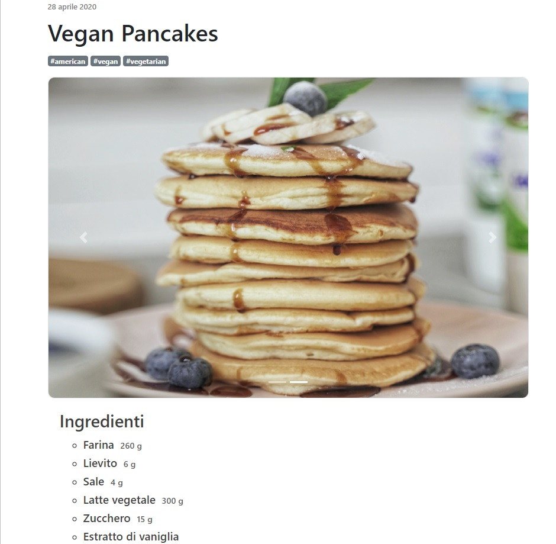
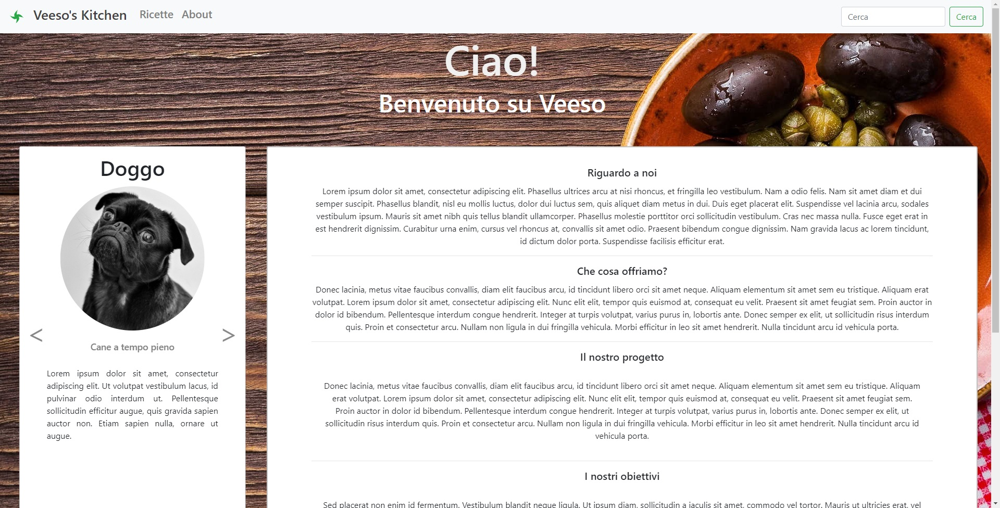

# Veeso's Kitchen

Developed by Christian Visintin

- [Veeso's Kitchen](#veesos-kitchen)
  - [Introduction](#introduction)
  - [Requirements](#requirements)
  - [Setup](#setup)
  - [Admin area](#admin-area)
  - [Gallery](#gallery)
  - [API](#api)
    - [Entities](#entities)
      - [Recipe](#recipe)
      - [Ingredient](#ingredient)
      - [RecipeIngredient](#recipeingredient)
      - [Category](#category)
      - [Tweet](#tweet)
    - [Requests](#requests)
      - [list categories](#list-categories)
      - [list recipes](#list-recipes)
      - [get recipe](#get-recipe)
      - [like recipe](#like-recipe)
      - [get tweets](#get-tweets)
  - [License](#license)

---

## Introduction

This project is just a React website which I use to improve my React/Django knowledge, to test libraries and for fun; and yeah, it's a recipe website which I've invented, since I like cooking.

## Requirements

for backend:

- python3
- pipenv

or

- json-server <https://github.com/typicode/json-server>. Used to gather data for recipes and tweets
  - Start with `json-server --watch data/server-data.json`

Json-server is no more supported, switch to `json-server` branch if you want to use it.

## Setup

1. Open a terminal and go to `recipes/`
2. Run `npm install && npm install`
3. Run `npm run build`
4. Run `pipenv shell`
5. Run `pipenv install`
6. Run `python manage.py runserver`

Website is now available at <http://localhost:8000/>

## Admin area

Credentials:

- veeso
- cvisintin97

---

## Gallery

> Home page



> Recipes navigator



> Recipe card



> About



---

## API

### Entities

#### Recipe

Recipe is made up of the following properties:

- **id** (*string*): primary key UUIDv4
- **titleIt** (*string*): recipe title (it)
- **titleEn** (*string*): recipe title (en)
- **category** (*Array::Category*): recipe categories
- **date** (*string:ISO8601*): publication date
- **img** (*Array::string:URL*): array of associated images
- **body** (*string*): procedure
- **ingredients** (*Array::Ingredient*): recipe ingredients
- **persons** (*number*): persons the ingredients are for
- **likes** (*number*): recipe likes

#### Ingredient

Ingredient represents an ingredient which can be included in a recipe.
The relation between `Recipe` and `Ingredient` is `n-n`.

- **id** (*string*): primary key UUIDv4
- **name** (*string*): ingredient name

#### RecipeIngredient

RecipeIngredient represents an ingredient in a certain recipe. This entity is both used to break the `n-n` relation between `Recipe` and `Ingredient` and to define a quantity for the ingredient in the recipe.

- **id** (*number*): relation ID
- **recipe** (*string*): FK; associated recipe ID
- **ingredient** (*string*): FK; associated ingredient ID
- **quantity** (*number | null*): optional quantity for ingredient
- **measure** (*string | null*): optional measure to quantity the ingredient.

#### Category

Category represents a recipe category

- **id** (*uuidv4*): category id
- **name** (*string*): category name

#### Tweet

Tweet is made up of the following properties:

- **id** (*string*): primary key UUIDv4
- **username** (*string*): Twitter username
- **nickname** (*string*): Twitter nickname (long name)
- **date** (*string:ISO8601*): publication date
- **text** (*string*): tweet's text
- **url** (*string:URL*): tweet url
- **avatar** (*string:URL*): avatar url

### Requests

#### list categories

**GET** `/api/list-categories`

Get the list of all the available categories.

returns:

```json
[
  {
    "id": 0,
    "name_it": "pranzi",
    "name_en": "lunch"
  },
  {
    "id": 1,
    "name_it": "colazioni",
    "name_en": "breakfast"
  }
]
```

#### list recipes

**GET** `/api/list-recipes`

get an undetailed list of recipes:

with the following parameters:

- **limit**: maximum amount of records
- **offset**: start index in the search
- **orderBy**: sort by field
  - *title_it*
  - *title_en*
  - *date*
  - *likes*
- **shuffle**: shuffle result set (doesn't make any sense combined with order by)
- **category**: search by category
- **title**: search by title

returns:

```json
[
  {
    "id": "a8fb4a0b-af17-4e99-96bb-cb8c7ec375d9",
    "title_it": "pasta alla carbonara",
    "title_en": "pasta carbonara",
    "categories": [
      "ad8fd528-5e40-47ff-8572-a74874d3c5bf",
    ],
    "date": "2019-05-28T12:30:40+0200",
    "img": [
      "/assets/images/contents/carbonara.jpg"
    ]
  }
]
```

#### get recipe

**GET** `/api/recipe/{ID}`

get details for a recipe.

with the following parameters:

- **id**: recipe id to get

returns:

```json
{
  "id": "a8fb4a0b-af17-4e99-96bb-cb8c7ec375d9",
  "title_it": "pizza margherita",
  "title_en": "pizza margherita",
  "likes": 24,
  "categories": [
    "ad8fd528-5e40-47ff-8572-a74874d3c5bf"
  ],
  "date": "2019-12-14T14:30:40+0200",
  "img": [
    "/assets/images/contents/pizza.jpg"
  ],
  "recipeIngredients": [{
      "name_it": "farina",
      "name_en": "flour",
      "quantity": 255,
      "measure": "g"
    },
    {
      "name_it": "acqua",
      "name_en": "water",
      "quantity": 150,
      "measure": "g"
    },
    {
      "name_it": "sale",
      "name_en": "salt",
      "quantity": 5,
      "measure": "g"
    },
    {
      "name_it": "olio d'oliva",
      "name_en": "olive oil",
      "quantity": 20,
      "measure": "g"
    },
    {
      "name_it": "lievito",
      "name_en": "baking powder",
      "quantity": 2.5,
      "measure": "g"
    }
  ],
  "persons": 2,
  "body_it": "Lorem ipsum dolor sit amet, consectetur adipscing elit. Morbi malesuada mi non dignissim ornare. Nunc elementum gravida mi. Curabitur bibendum, dolor ac luctus dignissim, eros sapien imperdiet nisi, eget volutpat magna mauris ornare ipsum. Morbi maximus nibh laoreet felis porta, et viverra dui consectetur. Nulla consequat urna ac quam feugiat tincidunt. Vivamus at tempor tortor. Nullam non mi ut risus pretium tempor. Aenean congue et orci in bibendum. Nulla commodo urna blandit ipsum elementum, vitae facilisis sapien varius. Ut rutrum, ipsum faucibus consequat fermentum, lacus mi imperdiet sem, sit amet malesuada lacus orci cursus nunc.Lorem ipsum dolor sit amet, consectetur adipiscing elit. Nulla nisl dui, ornare vel congue ut, ullamcorper ac enim. Donec sit amet tellus aliquam ex fringilla fermentum. Vivamus vel lacinia purus. Quisque vel urna fringilla, pellentesque tortor eget, laoreet libero. Vivamus tristique vehicula enim facilisis condimentum. Sed cursus, massa pellentesque maximus cursus, urna lectus accumsan lectus, vel sagittis eros ligula non purus.Nunc viverra leo sed est iaculis sollicitudin. Nunc consequat sed felis finibus cursus. Class aptent taciti sociosqu ad litora torquent per conubia nostra, per inceptos himenaeos. Sed euismod velit sed sem imperdiet dignissim. Orci varius natoque penatibus et magnis dis parturient montes, nascetur ridiculus mus. Sed mattis ex eget nibh euismod viverra. Donec id nisi fermentum, placerat dui eu, commodo sapien. Fusce convallis ligula sed euismod pretium. Integer facilisis, lectus non bibendum mollis, ex tortor vehicula purus, eu scelerisque odio est sed risus. Aenean cursus dui tempus ultricies pulvinar. In egestas pulvinar arcu, a varius diam aliquam non. Nullam in.",
  "body_en": "Lorem ipsum dolor sit amet, consectetur adipscing elit. Morbi malesuada mi non dignissim ornare. Nunc elementum gravida mi. Curabitur bibendum, dolor ac luctus dignissim, eros sapien imperdiet nisi, eget volutpat magna mauris ornare ipsum. Morbi maximus nibh laoreet felis porta, et viverra dui consectetur. Nulla consequat urna ac quam feugiat tincidunt. Vivamus at tempor tortor. Nullam non mi ut risus pretium tempor. Aenean congue et orci in bibendum. Nulla commodo urna blandit ipsum elementum, vitae facilisis sapien varius. Ut rutrum, ipsum faucibus consequat fermentum, lacus mi imperdiet sem, sit amet malesuada lacus orci cursus nunc.Lorem ipsum dolor sit amet, consectetur adipiscing elit. Nulla nisl dui, ornare vel congue ut, ullamcorper ac enim. Donec sit amet tellus aliquam ex fringilla fermentum. Vivamus vel lacinia purus. Quisque vel urna fringilla, pellentesque tortor eget, laoreet libero. Vivamus tristique vehicula enim facilisis condimentum. Sed cursus, massa pellentesque maximus cursus, urna lectus accumsan lectus, vel sagittis eros ligula non purus.Nunc viverra leo sed est iaculis sollicitudin. Nunc consequat sed felis finibus cursus. Class aptent taciti sociosqu ad litora torquent per conubia nostra, per inceptos himenaeos. Sed euismod velit sed sem imperdiet dignissim. Orci varius natoque penatibus et magnis dis parturient montes, nascetur ridiculus mus. Sed mattis ex eget nibh euismod viverra. Donec id nisi fermentum, placerat dui eu, commodo sapien. Fusce convallis ligula sed euismod pretium. Integer facilisis, lectus non bibendum mollis, ex tortor vehicula purus, eu scelerisque odio est sed risus. Aenean cursus dui tempus ultricies pulvinar. In egestas pulvinar arcu, a varius diam aliquam non. Nullam in."
}
```

#### like recipe

**POST** `/api/like-recipe/{ID}`

increment recipe likes by one.

#### get tweets

**GET** `/api/tweets`

- **limit**: maximum amount of records
- **offset**: start index in the search
- **orderBy**: sort by field
  - *date*
  - *username*

returns:

```json
[
  {
    "id": "c306cd77-d57c-4204-88fd-1bdb4697ee25",
    "username": "spegietasHD",
    "nickname": "Spegietas",
    "date": "2020-12-14T13:43:12Z",
    "text": "@veesoskitchen wait, is Sarah actually a cow?",
    "url": "https://twitter.com/",
    "avatar": "/data/cache/c306cd77-d57c-4204-88fd-1bdb4697ee25.jpg"
  },
  {
    "id": "53e9ea9e-cc27-4ae2-838b-d358a7617876",
    "username": "akontyfatti",
    "nickname": "Konty",
    "date": "2021-01-01T04:31:35",
    "text": "Pizza pazzesca #veesoskitchen",
    "url": "https://twitter.com/",
    "avatar": "/data/cache/53e9ea9e-cc27-4ae2-838b-d358a7617876.jpg"
  }
]
```

---

## License

View [LICENSE](LICENSE).

All images used in this website are royalty free.
